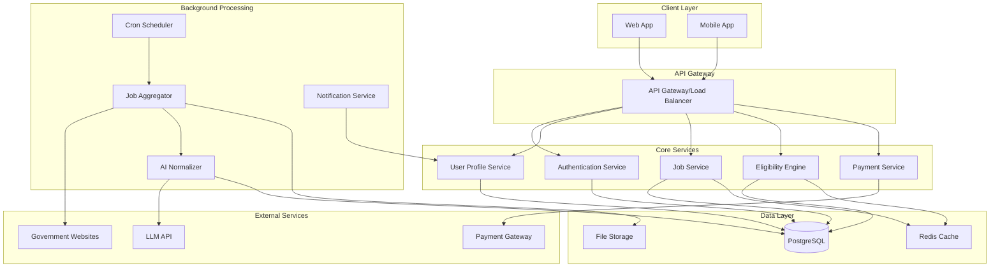

# Design Document: Sarkari Scan

## Overview

Sarkari Scan is a scalable, AI-powered platform designed to aggregate government job notifications from fragmented official sources and provide intelligent eligibility matching for Indian job aspirants. The system employs a microservices architecture with clear separation between job processing, user management, and eligibility checking to ensure scalability and maintainability.

The platform addresses the core problem of fragmented government job information by creating a unified, structured, and intelligent job discovery experience. The architecture prioritizes cost-efficiency through one-time AI processing, low-latency user interactions, and a sustainable credit-based monetization model.

## Architecture

The system follows a microservices architecture with the following high-level components:



## Components and Interfaces

### Frontend Applications

**Web Application**
- React-based responsive web application
- Optimized for desktop and tablet usage
- Implements job browsing, filtering, and eligibility checking interfaces
- Integrates with payment gateway for credit purchases

**Mobile Application**
- React Native cross-platform mobile app
- Optimized for mobile job discovery and notifications
- Offline capability for saved jobs and user profiles
- Push notification support for deadline reminders

### API Gateway

**Responsibilities:**
- Request routing and load balancing
- Rate limiting and API throttling
- Authentication token validation
- Request/response logging and monitoring

**Key Endpoints:**
- `/api/auth/*` - Authentication and session management
- `/api/jobs/*` - Job browsing, search, and filtering
- `/api/eligibility/*` - Eligibility checking and results
- `/api/profile/*` - User profile management
- `/api/payments/*` - Credit purchases and transactions

### Core Services

**Authentication Service**
- JWT-based authentication with refresh tokens
- Password hashing using bcrypt
- Session management and logout functionality
- Account creation and email verification

**User Profile Service**
- CRUD operations for user profiles
- Profile validation and data integrity checks
- Privacy controls and data export functionality
- Integration with eligibility engine for profile matching

**Job Service**
- Job listing retrieval with pagination
- Advanced filtering by category, location, education, deadlines
- Full-text search across job titles and descriptions
- Saved jobs management and user preferences
- Job detail views with original source links

**Eligibility Engine**
- Real-time eligibility checking against normalized job criteria
- Rule-based matching for age, education, category, and location
- Detailed explanation generation for eligibility decisions
- Caching of frequent eligibility combinations
- Confidence scoring for ambiguous criteria

**Payment Service**
- Credit balance management and transaction history
- Integration with payment gateways (Razorpay, Stripe)
- Subscription and bulk credit purchase options
- Refund processing and dispute handling

### Background Processing Services

**Job Aggregator**
- Scheduled scraping of government job websites
- PDF parsing and text extraction from job notifications
- Duplicate detection and consolidation
- Source reliability tracking and error handling
- Rate limiting to respect source website policies

**AI Normalizer**
- LLM-based extraction of structured data from job descriptions
- Standardization of eligibility criteria formats
- Confidence scoring for extracted information
- Batch processing for cost optimization
- Manual review queue for low-confidence extractions

**Cron Scheduler**
- Daily job aggregation scheduling
- Deadline reminder notifications
- System health checks and monitoring
- Database cleanup and archival tasks
- Performance metrics collection

**Notification Service**
- Email and push notification delivery
- Template-based notification generation
- User preference management
- Delivery tracking and retry logic
- Unsubscribe and preference management

## Data Models

### User Profile
```typescript
interface UserProfile {
  id: string;
  email: string;
  passwordHash: string;
  profile: {
    age: number;
    education: EducationLevel[];
    category: ReservationCategory;
    preferredLocations: string[];
    experience: number;
  };
  creditBalance: number;
  preferences: NotificationPreferences;
  createdAt: Date;
  updatedAt: Date;
}
```

### Job Notification
```typescript
interface JobNotification {
  id: string;
  title: string;
  organization: string;
  sourceUrl: string;
  originalPdfUrl?: string;
  
  // Normalized eligibility criteria
  eligibility: {
    ageRange: { min: number; max: number };
    education: EducationRequirement[];
    category: CategoryEligibility;
    location: LocationRequirement[];
    experience?: ExperienceRequirement;
  };
  
  // Application details
  applicationDeadline: Date;
  examDate?: Date;
  applicationFee: FeeStructure;
  
  // Processing metadata
  normalizationConfidence: number;
  lastUpdated: Date;
  status: 'active' | 'expired' | 'cancelled';
}
```

### Eligibility Result
```typescript
interface EligibilityResult {
  id: string;
  userId: string;
  jobId: string;
  isEligible: boolean;
  reasons: EligibilityReason[];
  confidence: number;
  checkedAt: Date;
  creditsUsed: number;
}

interface EligibilityReason {
  criterion: string;
  userValue: any;
  requiredValue: any;
  status: 'pass' | 'fail' | 'warning';
  explanation: string;
}
```

## Error Handling

### API Error Responses
- Standardized error response format with error codes and messages
- Detailed validation errors for form submissions
- Rate limiting errors with retry-after headers
- Authentication errors with clear resolution steps

### Background Processing Errors
- Retry mechanisms with exponential backoff for transient failures
- Dead letter queues for failed job processing
- Alert systems for critical failures (aggregation, normalization)
- Graceful degradation when external services are unavailable

### Data Integrity
- Database constraints and foreign key relationships
- Transaction management for multi-step operations
- Data validation at service boundaries
- Audit logging for critical data changes

## Testing Strategy

*A property is a characteristic or behavior that should hold true across all valid executions of a system—essentially, a formal statement about what the system should do. Properties serve as the bridge between human-readable specifications and machine-verifiable correctness guarantees.*

The testing strategy employs both unit testing and property-based testing to ensure comprehensive coverage. Unit tests validate specific examples and edge cases, while property tests verify universal properties across all inputs. Together, they provide robust validation of system correctness.

### Property-Based Testing

Property-based testing will be implemented using Hypothesis (Python) for backend services and fast-check (TypeScript) for frontend components. Each property test will run a minimum of 100 iterations to ensure comprehensive input coverage.

Now I need to analyze the acceptance criteria to create correctness properties. Let me use the prework tool:

### Correctness Properties

Based on the prework analysis, the following properties validate the core functional requirements:

**Property 1: Job Source Preservation**
*For any* job notification that gets aggregated, the system should preserve direct links to original official job postings and application pages
**Validates: Requirements 1.3**

**Property 2: Job Deduplication**
*For any* set of job notifications with identical title, organization, and deadline, the system should consolidate them into a single entry
**Validates: Requirements 1.4**

**Property 3: Document Preservation**
*For any* job notification with original PDF documents, the system should preserve and maintain access to those documents
**Validates: Requirements 1.5**

**Property 4: AI Extraction Completeness**
*For any* job notification processed by the AI normalizer, the output should contain structured fields for age limits, education requirements, category reservations, and location preferences
**Validates: Requirements 2.1**

**Property 5: Data Standardization**
*For any* unstructured job description input, the AI normalizer should convert it to conform to the standard schema format
**Validates: Requirements 2.2**

**Property 6: Critical Information Extraction**
*For any* job notification, the AI normalizer should extract application deadlines, exam dates, and fee information when present in the source
**Validates: Requirements 2.3**

**Property 7: Low Confidence Flagging**
*For any* job normalization with confidence score below the threshold, the system should flag the job for manual review
**Validates: Requirements 2.5**

**Property 8: Profile Management Round Trip**
*For any* user profile data (age, education, category, locations), creating then retrieving the profile should return equivalent data
**Validates: Requirements 3.1, 3.4, 3.5**

**Property 9: Profile Validation**
*For any* profile update with invalid data format, the system should reject the update and preserve the existing valid profile
**Validates: Requirements 3.2**

**Property 10: Comprehensive Eligibility Checking**
*For any* user profile and job criteria combination, the eligibility engine should return a clear status (Eligible/Not Eligible) with detailed explanations for all criteria
**Validates: Requirements 4.1, 4.2, 4.3**

**Property 11: Ambiguous Criteria Warnings**
*For any* eligibility check with low confidence scores, the result should include cautionary guidance to verify with official sources
**Validates: Requirements 4.5**

**Property 12: Job Filtering Completeness**
*For any* combination of filter criteria (category, education, location, deadlines), the system should return only jobs that match all specified filters
**Validates: Requirements 5.1**

**Property 13: Job Save and Retrieve**
*For any* job saved by a user, the system should allow retrieval of that job in the user's saved jobs list
**Validates: Requirements 5.3**

**Property 14: Search Result Relevance**
*For any* search query, results should only include jobs where the query terms appear in job titles, organizations, or descriptions
**Validates: Requirements 5.4**

**Property 15: Conditional Eligibility Display**
*For any* job result displayed to a user with an active profile, the result should include eligibility status information
**Validates: Requirements 5.5**

**Property 16: Notification Scheduling**
*For any* job saved by a user, the system should create deadline reminder notifications scheduled for 7 days, 3 days, and 1 day before application closure
**Validates: Requirements 6.1, 6.2**

**Property 17: Preference-Based Notifications**
*For any* new job that matches a user's preferences, the system should notify all eligible users who have enabled notifications
**Validates: Requirements 6.3**

**Property 18: Notification Configuration**
*For any* user notification preference changes, the system should respect those preferences in future notification delivery
**Validates: Requirements 6.4**

**Property 19: Multi-Channel Delivery**
*For any* notification triggered by the system, it should be delivered through both email and in-app messaging channels
**Validates: Requirements 6.5**

**Property 20: Free Job Browsing**
*For any* user without credits or payment, the system should allow browsing jobs and viewing basic information
**Validates: Requirements 7.1**

**Property 21: Credit Management**
*For any* eligibility check request, the system should deduct the correct credits, maintain accurate balances, and create proper transaction records
**Validates: Requirements 7.2, 7.4, 7.5**

**Property 22: Credit Purchase Options**
*For any* user requesting credit purchases, the system should provide multiple purchase options with secure payment processing
**Validates: Requirements 7.3**

**Property 23: Authentication Security**
*For any* user password, the system should store it using secure hashing and maintain proper session management
**Validates: Requirements 9.2**

**Property 24: Account Deletion**
*For any* user account deletion request, the system should permanently remove all associated personal data
**Validates: Requirements 9.3**

**Property 25: Caching Efficiency**
*For any* repeated database query or AI processing request, the system should utilize caching to reduce redundant operations
**Validates: Requirements 10.5**

### Unit Testing Strategy

Unit tests will focus on:
- **Specific Examples**: Test concrete scenarios like parsing specific government job PDFs
- **Edge Cases**: Handle empty job descriptions, malformed dates, missing eligibility criteria
- **Error Conditions**: Invalid user inputs, network failures, payment processing errors
- **Integration Points**: API endpoint responses, database transactions, external service calls

### Property-Based Testing Configuration

Property tests will be implemented using:
- **Backend Services**: Hypothesis (Python) for API services and data processing
- **Frontend Components**: fast-check (TypeScript) for UI logic and form validation
- **Test Configuration**: Minimum 100 iterations per property test
- **Tagging Format**: Each test tagged as **Feature: sarkari-scan, Property {number}: {property_text}**

Property tests will generate random inputs within valid domains to verify universal properties hold across all possible system states and user interactions.